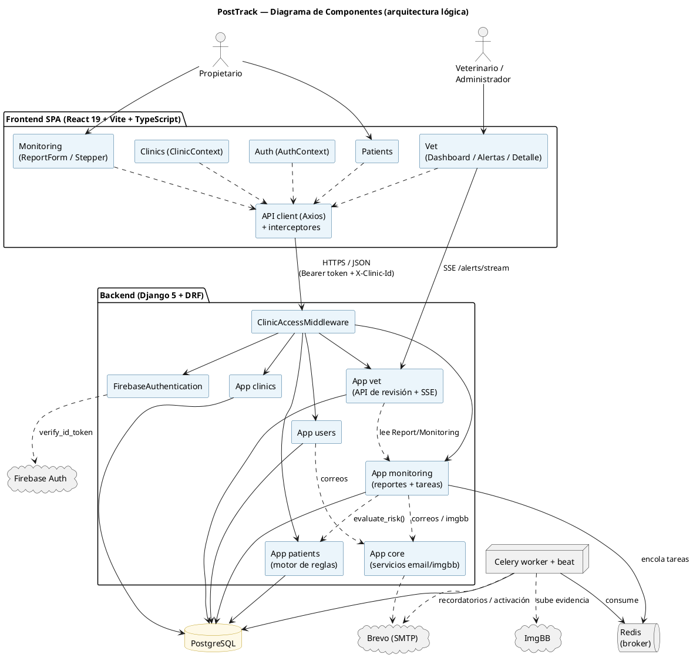
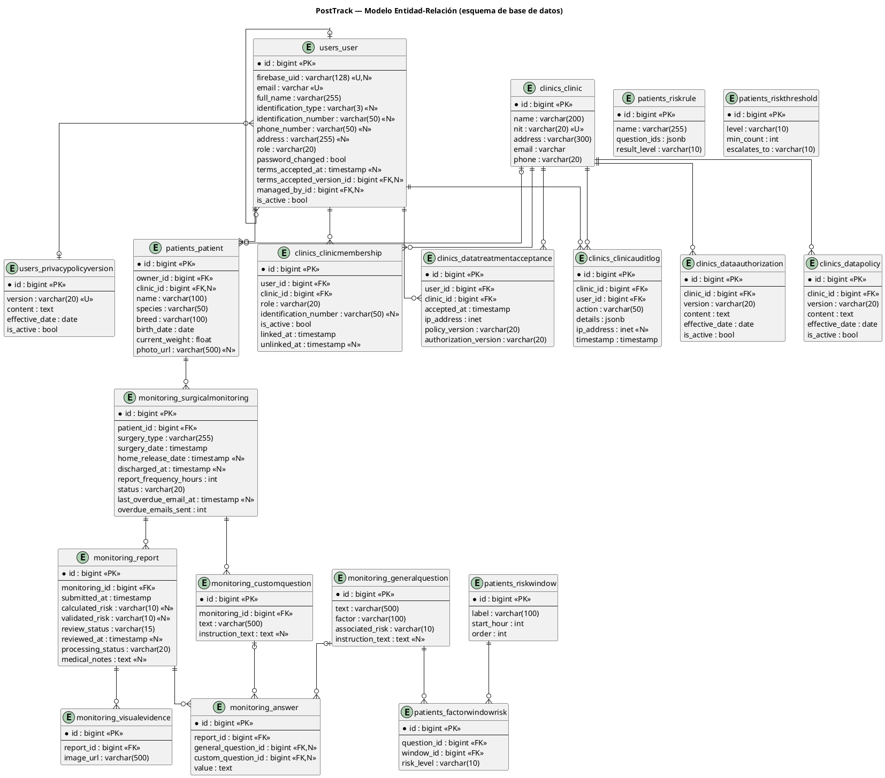

# 🐾 PostTrack

> Sistema de apoyo para la **detección temprana de riesgo postoperatorio** en pacientes veterinarios (perros y gatos) mediante monitoreo domiciliario y recolección estructurada de datos.


---

## 📑 Tabla de contenidos

- [Contexto y problema](#-contexto-y-problema)
- [¿Qué hace PostTrack?](#-qué-hace-posttrack)
- [Características principales](#-características-principales)
- [Modelo de clasificación de riesgo](#-modelo-de-clasificación-de-riesgo)
- [Roles y flujos](#-roles-y-flujos)
- [Arquitectura](#-arquitectura)
- [Stack tecnológico](#-stack-tecnológico)
- [Estructura del repositorio](#-estructura-del-repositorio)
- [Puesta en marcha](#-puesta-en-marcha)
- [Variables de entorno](#-variables-de-entorno)
- [Comandos útiles](#-comandos-útiles)
- [Documentación](#-documentación)
- [Autores](#-autores)

---

## 🩺 Contexto y problema

Tras una cirugía, el seguimiento del paciente veterinario ocurre en casa y recae sobre el **propietario**, que no tiene formación médica. Muchos animales ocultan el dolor por instinto y las complicaciones (infección del sitio quirúrgico, seromas, dehiscencia, etc.) suelen detectarse **tarde**. La comunicación informal (WhatsApp, fotos sin contexto) satura al veterinario y dificulta priorizar los casos urgentes.

**PostTrack** cierra esa brecha: estructura lo que el propietario observa en casa, lo convierte en datos clínicos comparables y **clasifica automáticamente el nivel de riesgo** (bajo / medio / alto) para que el profesional priorice y decida — sin sustituir nunca su criterio.

Proyecto académico — **Ingeniería de Sistemas y Computación, Universidad Tecnológica de Pereira**.

---

## ✨ ¿Qué hace PostTrack?

- El **veterinario** crea un monitoreo postoperatorio (tipo de cirugía, fecha, frecuencia de reportes y preguntas personalizadas) y lo asocia a una mascota y su dueño.
- El **propietario** recibe la indicación de reportar desde casa y responde, en cada reporte:
  1. Un **cuestionario fijo** de 21 preguntas cerradas (Sí/No).
  2. **Preguntas personalizadas** que añadió el veterinario.
  3. **Observaciones libres** y **fotos** de la herida (opcionales).
- El sistema **calcula el riesgo** del reporte según la **ventana temporal** postoperatoria y un motor de reglas clínicas.
- El veterinario revisa una **bandeja priorizada por riesgo**, valida o corrige la clasificación y marca el caso como revisado, con **alertas en tiempo real** y avisos de reportes vencidos.

---

## 🚀 Características principales

- 🔐 **Autenticación con Firebase** y roles (Administrador, Veterinario, Propietario).
- 🏥 **Multiclínica con aislamiento de datos** (`ClinicAccessMiddleware` + selección de clínica activa), alineado con la **Ley 1581 de 2012** de protección de datos.
- 📋 **Recolección estructurada**: cuestionario fijo + preguntas personalizadas + notas + evidencia fotográfica.
- 🧠 **Motor de reglas clínicas** sensible a ventanas temporales (ver abajo).
- 📊 **Tablero del veterinario**: estadísticas, bandeja por prioridad, alertas en tiempo real vía **SSE** y reportes vencidos.
- ⏰ **Recordatorios automáticos** de reportes vencidos vía **Celery + Redis** (con control anti-spam).
- 🖼️ **Carga asíncrona de imágenes** a ImgBB mediante tareas Celery.
- 📧 **Correos transaccionales** (activación de cuenta, recordatorios) vía Brevo SMTP.
- 🕓 **Historial auditable** de cada reporte (`django-simple-history`) y registro de auditoría de acceso a datos.

---

## 🧠 Modelo de clasificación de riesgo

El riesgo de cada signo **no es fijo**: depende de la **ventana temporal** medida en horas desde la cirugía.

| Ventana | Rango |
|---|---|
| Ventana 1 | 0 – 48 h (días 0–2) |
| Ventana 2 | 49 – 120 h (días 3–5) |
| Ventana 3 | ≥ 121 h (día 6 en adelante) |

Para cada reporte, el servicio `evaluate_risk` (`backend/src/apps/patients/services/risk_evaluation.py`):

1. Resuelve la **ventana activa** (la de mayor `start_hour` ≤ horas desde la cirugía).
2. Asigna a cada factor en "Sí" su nivel de riesgo en esa ventana (`FactorWindowRisk`, con respaldo en el riesgo por defecto de la pregunta).
3. Reúne **candidatos** de tres fuentes: el factor individual más alto, las **combinaciones críticas** (`RiskRule`) que se cumplan y los **umbrales de acumulación** (`RiskThreshold`).
4. El nivel final es el **MÁXIMO** de todos los candidatos.

> 💡 El orden de las reglas no altera el resultado: **siempre gana el riesgo más alto**. Los umbrales, combinaciones y niveles por ventana son **parametrizables** desde la base de datos.

---

## 👥 Roles y flujos

| Rol | Puede |
|---|---|
| **Administrador** | Todo lo del veterinario + vincular/desvincular veterinarios a clínicas; acceder a cualquier clínica. |
| **Veterinario** | Crear propietarios, pacientes y monitoreos; registrar salida a casa y alta; revisar y validar reportes; ver alertas y reportes vencidos. |
| **Propietario** | Ver sus mascotas, enviar reportes postoperatorios y consultar el historial. |

Flujos detallados (envío de reporte, revisión, autenticación, recordatorios, alertas en tiempo real) en los [diagramas de secuencia y actividades](docs/diagramas).

---

## 🏗️ Arquitectura

Aplicación web desacoplada (SPA + API REST) orquestada con Docker Compose.



**Modelo de datos (entidad-relación):**



---

## 🛠️ Stack tecnológico

| Capa | Tecnologías |
|---|---|
| **Frontend** | React 19, TypeScript, Vite 7, Tailwind CSS 4, React Router 6, Axios, Firebase SDK, Lucide Icons |
| **Backend** | Python 3.12, Django 5, Django REST Framework, django-simple-history, django-unfold, firebase-admin |
| **Tareas / colas** | Celery 5 + Redis 7 (worker + beat) |
| **Base de datos** | PostgreSQL 15 |
| **Servicios externos** | Firebase Auth, ImgBB (imágenes), Brevo (SMTP) |
| **Infraestructura** | Docker, Docker Compose |

---

## 📁 Estructura del repositorio

```
PostTrack/
├── backend/                     # API Django + DRF
│   ├── src/
│   │   ├── apps/
│   │   │   ├── core/            # base abstracta + servicios (email, imgbb)
│   │   │   ├── users/           # usuarios, roles, autenticación Firebase
│   │   │   ├── clinics/         # multiclínica, membresías, protección de datos
│   │   │   ├── patients/        # pacientes + motor de reglas de riesgo
│   │   │   ├── monitoring/      # monitoreos, reportes, respuestas, tareas Celery
│   │   │   └── vet/             # API de revisión del veterinario + SSE
│   │   └── config/             # settings, celery, urls
│   └── Dockerfile
├── frontend/                    # SPA React + Vite
│   └── src/
│       ├── app/                # router + guards por rol
│       ├── features/           # auth, clinics, patients, monitoring, vet
│       ├── pages/              # páginas por rol (auth / owner / vet)
│       └── shared/             # cliente API, layouts, utilidades
├── docs/
│   ├── anteproyecto/           # anteproyecto académico (LaTeX)
│   └── diagramas/              # 20 diagramas UML (PlantUML) + SVG/PNG
├── docker-compose.dev.yml
├── Makefile
└── README.md
```

---

## ⚙️ Puesta en marcha

### Requisitos previos

- [Docker](https://www.docker.com/) y Docker Compose
- Una cuenta de **Firebase** (Authentication con email/contraseña) y su archivo de credenciales de servicio
- (Opcional para correos/imágenes) claves de **Brevo** e **ImgBB**

### Pasos

```bash
# 1. Clonar
git clone https://github.com/alejoq11977/PostTrack.git
cd PostTrack

# 2. Configurar variables de entorno (ver sección siguiente)
cp backend/src/.env.example backend/src/.env      # editar
#  + crear .env (raíz) y frontend/.env.local
#  + colocar backend/src/config/firebase-credentials.json

# 3. Levantar todo el entorno
make up          # docker compose -f docker-compose.dev.yml up
```

Servicios disponibles:

| Servicio | URL |
|---|---|
| Frontend (Vite) | http://localhost:5173 |
| API (Django) | http://localhost:8000/api |
| Admin de Django | http://localhost:8000/admin |
| PostgreSQL | localhost:5432 |
| Redis | localhost:6379 |

Las migraciones se aplican automáticamente al iniciar el backend.

---

## 🔑 Variables de entorno

> ⚠️ **Ningún archivo con secretos se versiona.** Usa los `*.example` como plantilla. Nunca subas `.env`, `*.env.local` ni `firebase-credentials.json`.

**`.env` (raíz)** — usado por Docker Compose:

```env
POSTGRES_USER=posttrack_user
POSTGRES_PASSWORD=posttrack_password
POSTGRES_DB=posttrack_db
DJANGO_SECRET_KEY=<una-clave-secreta>
IMGBB_API_KEY=<tu-clave-imgbb>
```

**`backend/src/.env`** — basado en `backend/src/.env.example` (correos, URL del frontend, etc.).

**`frontend/.env.local`** — configuración del cliente (la API y la config pública de Firebase):

```env
VITE_API_URL=http://localhost:8000/api
VITE_IMGBB_API_KEY=<tu-clave-imgbb>
VITE_FIREBASE_API_KEY=...
VITE_FIREBASE_AUTH_DOMAIN=...
VITE_FIREBASE_PROJECT_ID=...
VITE_FIREBASE_STORAGE_BUCKET=...
VITE_FIREBASE_MESSAGING_SENDER_ID=...
VITE_FIREBASE_APP_ID=...
```

**`backend/src/config/firebase-credentials.json`** — clave de cuenta de servicio de Firebase (Admin SDK).

---

## 🧰 Comandos útiles

```bash
make up              # levantar el entorno de desarrollo
make down            # detener los contenedores
make build           # reconstruir las imágenes
make bash            # consola dentro del contenedor backend
make migrate         # aplicar migraciones
make makemigrations  # generar migraciones
```

Frontend (fuera de Docker, opcional):

```bash
cd frontend
npm install
npm run dev          # servidor de desarrollo
npm run build        # build de producción
```

---

## 📚 Documentación

- **Anteproyecto académico**: [`docs/anteproyecto/anteproyecto-posttrack.tex`](docs/anteproyecto/anteproyecto-posttrack.tex)
- **Diagramas UML** (casos de uso, clases, entidad-relación, componentes, despliegue, estados, actividades, secuencia): [`docs/diagramas/`](docs/diagramas) — fuentes PlantUML + imágenes SVG/PNG. Ver [`docs/diagramas/README.md`](docs/diagramas/README.md).

---

## 👨‍💻 Autores

- **José Alejandro Quintero Gahona**

Universidad Tecnológica de Pereira — Ingeniería de Sistemas y Computación.

---

## 📄 Licencia

Copyright © 2026 José Alejandro Quintero Gahona.

Este proyecto se distribuye bajo los términos de la **GNU General Public License v3.0 (GPL-3.0)**. Puedes usar, estudiar, modificar y redistribuir el código, pero cualquier obra derivada que se distribuya debe publicarse también bajo la misma licencia (copyleft). El texto completo está en el archivo [`LICENSE`](LICENSE).
